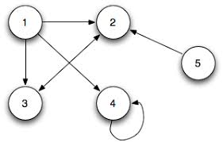
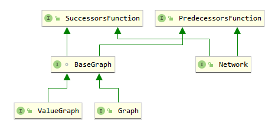
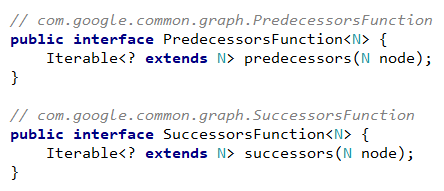

## 概述

图被用于描述实体及实体间的关系，这样的例子有如网页和超链接、科学家及其撰写的论文、机场及其之间的路线等等。`com.google.common.graph` 包提供了对 `图` 这种数据结构的实现，

从数据结构来看，图是非线性的，它由一组节点和一组边组成，每条边将两个节点相连，这两个节点亦称端点（endpoints）。根据是否区分端点为起始节点和目标节点，又可将边分为有向边和无向边。如果图的每个边都是有向的，则图是有向的；如果图的每个边都是无向的，则图是无向的。common.graph 不支持同时具有有向边和无向边的图。

<div align="center"></img></div>

<

看下下面的例子

```java
graph.addEdge(nodeU, nodeV, edgeUV);
```

- nodeU 和 nodeV 两个节点彼此相邻
- edgeUV 是入射到 nodeU 并 nodeV（且反之亦然）

如果 graph 是有向的，则 nodeU 是 nodeV 的前继节点，nodeV 是 nodeU 的后继节点，即边 edgeUV 从节点 nodeU 指向 nodeV。如果 graph 是无向的，则 nodeU 是 nodeV 同时为彼此的前继节点和后继节点。所有这些关系都取决于 graph 的类型。

在图论中，自环（self-loop）是一条顶点与自身连接的边。如果自环是有向的，则对于环中那个节点而言，自环既是出边也是入边；对于自环而言，环中那个节点既是源节点也是目标节点，见下图中的节点4.

<div align="center"></img></div>

如果两条边所连接的相同的节点以相同的顺序（如果有的话），则称它们是平行的。如果它们所连接的相同的节点以相反的顺序，则称它们是反平行的（无方向的边不能反平行）。看下面的示例：

```java
directedGraph.addEdge(nodeU, nodeV, edgeUV_a);
directedGraph.addEdge(nodeU, nodeV, edgeUV_b);
directedGraph.addEdge(nodeV, nodeU, edgeVU);

undirectedGraph.addEdge(nodeU, nodeV, edgeUV_a);
undirectedGraph.addEdge(nodeU, nodeV, edgeUV_b);
undirectedGraph.addEdge(nodeV, nodeU, edgeVU);
```

在 directedGraph 中，edgeUV_a 和 edgeUV_b 是彼此平行的，而它们都是与 edgeVU 反平行的。在 undirectedGraph 中，edgeUV_a、edgeUV_b 和 edgeVU 中每个都与另外两个彼此平行。

## guava 的图类库功能

`common.graph` 专注于提供接口和类以支持使用图。它不提供 I/O 或可视化支持等功能，并且工具类的选择非常有限。更多相关详见 [FAQ](https://github.com/google/guava/wiki/GraphsExplained#faq)。
 
总体而言，`common.graph` 支持以下类型的图：

- 有向图
- 无向图
- 具有关联值（权重，标签等）的节点和/或边
- 允许/不允许自循环的图
- 允许/不允许平行边的图（具有平行边的图有时称为多图）
- 节点/边按插入顺序排列、排序或无序的图

特定 `common.graph` 类型支持的图的类型在其 Javadoc 中有说明。Javadoc 在其相关 Builder 类型中指定了每种图形类型的内置实现所支持的图类型。该库中类型的特定实现（尤其是第三方实现）不需要支持所有这些变体，并且可能还支持其他变体。

该库与基础数据结构的选择无关：可以将关系存储为矩阵、邻接表、邻接图等，具体取决于实现者想要优化的用例。

`common.graph`（目前）不提供对以下图变体的明确支持，尽管可以使用现有的类型对它们进行建模：

- 树木，森林
- 具有相同类型（节点或边）的元素且具有不同类型的图（例如：二分图/k分图，多峰图）
- 超图

 [`Graphs`](http://google.github.io/guava/releases/snapshot/api/docs/com/google/common/graph/Graphs.html) 不允许图形同时具有有向边和无向边。

 [`Graphs`](http://google.github.io/guava/releases/snapshot/api/docs/com/google/common/graph/Graphs.html) 类提供了一些基本的工具方法，如复制和比较图等。

## 图的类型

`common.graph` 提供了三个顶层的图接口，根据边的表示不同，分为 `Graph`、`ValueGraph` 和 `Network`，它们都是兄弟或叔侄，即它们中任何两个都没有继承关系。

<div align="center"></img></div>

从上图可见，这些顶层接口都扩展了 [`SuccessorsFunction`](http://google.github.io/guava/releases/snapshot/api/docs/com/google/common/graph/SuccessorsFunction.html) 和 [`PredecessorsFunction`](http://google.github.io/guava/releases/snapshot/api/docs/com/google/common/graph/PredecessorsFunction.html) 接口。这两个接口旨在用作图论算法的参数类型（例如广度优先遍历），这些算法仅需要一种访问图中一个节点的后继/前继节点的方式。

当图的所有者已经具有适当的图的表示方式，并且不特别希望只为了运行一种图算法将这种表示方式序列化为 `common.graph` 时，这两个接口就能发挥作用了。

<div align="center"></img></div>

### Graph

接口签名：

```java
/**
 * @param <N> Node parameter type
 */
public interface Graph<N> extends BaseGraph<N> {}
```

[`Graph`](http://google.github.io/guava/releases/snapshot/api/docs/com/google/common/graph/Graph.html) 是最简单、最基础的图类型。它定义了基本的用于处理节点与节点间关系的操作，如 `successors(node)`、`adjacentNodes(node)` 和 `inDegree(node)`。Graph 中的节点是唯一的，实际上，Graph 用 Set 保存其所有节点。

`Graph` 的边是完全匿名的；它们仅根据其端点进行定义。

对于使用示例 `Graph<Airport>`：其边连接了机场，机场是唯一的，机场之间可以直飞。

### ValueGraph

接口签名：

```java
/**
 * @param <N> Node parameter type
 * @param <V> Value parameter type
 */
@Beta
public interface ValueGraph<N, V> extends BaseGraph<N> {}
```

可以看到，[`ValueGraph`](http://google.github.io/guava/releases/snapshot/api/docs/com/google/common/graph/ValueGraph.html) 的类签名上使用了两个泛型标记，这是因为其中每条边都关联了用户的指定值。这些值不必是唯一的（就像节点一样）。`ValueGraph` 和 `Graph` 之间的关系是类似于 `Map` 和 `Set`；`Graph`的边是一组端点对（EndpointPair），`ValueGraph`的边是从对端点到关联值的映射。

`ValueGraph` 具有 [`Graph`](http://google.github.io/guava/releases/snapshot/api/docs/com/google/common/graph/Graph.html) 中所有与节点有关的方法，但是添加了一些方法来检索指定边的关联值。

`ValueGraph` 提供一个叫 `asGraph()` 的方法用来返回的 `ValueGraph` 的 `Graph` 视图 。这允许对 `Graph` 实例进行操作的方法也可以对 `ValueGraph` 实例起作用。

用例示例：`ValueGraph<Airport, Integer>`，其边值表示 `Airport` 在边连接的两个机场间移动所需的时间。

### Network

接口签名：

```java
/**
 * @param <N> Node parameter type
 * @param <E> Edge parameter type
 */
public interface Network<N, E> extends SuccessorsFunction<N>, PredecessorsFunction<N> {}
```

[`Network`](http://google.github.io/guava/releases/snapshot/api/docs/com/google/common/graph/Network.html) 拥有 `Graph` 中所有的节点相关的方法，但增加了用于描述边及节点与边之间关系的方法，如 `outEdges(node)`、`incidentNodes(edge)` 和 `edgesConnecting(nodeU, nodeV)`。

像所有图类型中的节点一样，`Network`的边是唯一的。边的唯一性约束允许 [`Network`](http://google.github.io/guava/releases/snapshot/api/docs/com/google/common/graph/Network.html) 本地支持平行边以及用于描述边与边间及节点与边间的关系的方法。

[`Network`](http://google.github.io/guava/releases/snapshot/api/docs/com/google/common/graph/Network.html) 提供一个叫 `asGraph()` 的方法用于返回的 `Network` 的 `Graph` 视图，这允许对 `Graph` 实例进行操作的方法也可以对 `Network` 实例起作用。

用例示例：`Network<Airport Flight>`，其中边表示从一个机场到另一个机场可以乘坐的特定航班。

### 选择正确的图类型

三种图形类型之间的本质区别在于边的表示形式。

- Graph：边是节点间的匿名连接，没有其自身的标识或属性。你应该使用`Graph`，如果每一对节点由最多一个边连接，而你不需将任何信息与边相关联。

- ValueGraph：每条边都有相关值（例如，边缘权重或标签），这些值可能是唯一的也可能不是唯一的。如果图中每对节点最多由一条边连接，并且需要将某些信息（例如，边权重）与边关联，则应该使用 `ValueGraph`。

- Network 每条边都有唯一的关联值。如果边对象是唯一的（请注意，此唯一性允许 `Network` 支持平行边），并且希望能够将边与值进行关联。则应该使用 `Network`。

## 构建图实例

`common.graph` 中使用了 Builder 设计模式，其提供的实现类不是公共的。这减少了用户需要了解的公共类型的数量，并使得导航内置实现所提供的各种功能变得更加容易，而不会让那些只想创建图形的用户迷失在众多的实现中。

为了创建内置的图类型的实现，需要使用相应的 Builder 类实例：GraphBuilder，ValueGraphBuilder，或NetworkBuilder。例子：

```java
// 创建可变图
MutableGraph<Integer> graph = GraphBuilder.undirected().build();
MutableValueGraph<City, Distance> roads = ValueGraphBuilder.directed().build();

MutableNetwork<Webpage, Link> webSnapshot = NetworkBuilder.directed()
    .allowsParallelEdges(true)
    .nodeOrder(ElementOrder.natural())
    .expectedNodeCount(100000)
    .expectedEdgeCount(1000000)
    .build();

// Creating an immutable graph
ImmutableGraph<Country> countryAdjacencyGraph =
    GraphBuilder.undirected()
        .<Country>immutable()
        .putEdge(FRANCE, GERMANY)
        .putEdge(FRANCE, BELGIUM)
        .putEdge(GERMANY, BELGIUM)
        .addNode(ICELAND)
        .build();
```

- 你可以通过以下两种方式之一获得图 Builder 实例：
 
   - 调用静态方法 `directed()` 或`undirected()`。`Builder` 提供的每个 Graph 实例将是有向的或无向的。
   - 调用静态方法 `from()`，它会为你提供了一个基于现有图实例的 `Builder` 实例。
 
 - 创建`Builder`实例后，可以选择指定其他特征和功能。
 
 - 建立可变图
 
   - 你可以在同一 `Builder` 实例上多次调用 `build()` 方法，以使用相同的配置构建多个图形实例。
   - 你无需在 `Builder` 实例上指定元素类型。在图类型上指定即可。
   - 该 `build()` 方法返回 `Mutable` 相关图类型的子类，该子类提供了变异方法，有关更多信息，请参见 [“ `Mutable`和`Immutable`图形”](https://github.com/google/guava/wiki/GraphsExplained#mutable-and-immutable-graphs)。
 
 - 建立不可变图
 
   - 你可以在同一`Builder`实例上多次调用 `immmutable()` 方法，利用相同配置，创建多个 `ImmutableGraph.Builder` 对象。
   - 你需要在 `immutable` 调用中指定元素类型。

## 构建器约束与优化提示

这些与图创建相关的 Builder 类型通常提供两种类型的选项：约束和优化提示。

约束指定了由给定的 Builder 实例创建的图必须满足的行为和属性，例如：

- 该图是否有向
- 该图是否允许自环
- 此图的边是否已排序

实现类可以选择使用优化提示来提高效率，例如，确定内部数据结构的类型或初始大小的操作是不被保证高效的，这时可使用优化提示。每种图类型都提供与其指定 Builder 约束相对应的访问器，但不为优化提示提供访问器。

## 可变图（Mutable）和不可变（Immutable）图

### `Mutable*` 类型

每个图类型接口都有一个对应的 `Mutable*` 子接口： [`MutableGraph`](http://google.github.io/guava/releases/snapshot/api/docs/com/google/common/graph/MutableGraph.html)、[`MutableValueGraph`](http://google.github.io/guava/releases/snapshot/api/docs/com/google/common/graph/MutableValueGraph.html) 和 [`MutableNetwork`](http://google.github.io/guava/releases/snapshot/api/docs/com/google/common/graph/MutableNetwork.html) 这些子接口定义了突变方法：

- 添加和删除节点的方法：
  - `addNode(node)` 和 `removeNode(node)`
- 添加和删除边的方法：
  - `MutableGraph`
    - `putEdge(nodeU, nodeV)`
    - `removeEdge(nodeU, nodeV)`
  - `MutableValueGraph`
    - `putEdgeValue(nodeU, nodeV, value)`
    - `removeEdge(nodeU, nodeV)`
  - `MutableNetwork`
    - `addEdge(nodeU, nodeV, edge)`
    - `removeEdge(edge)`

这与 Java Collections Framework 和 Guava 的新 collection 类在过去的工作方式背道而驰；因为无论是 JCF 还是 Guava 的集合，都将那些公共的方法（添加/删除）抽取到上一层接口中，而这里每个 `Mutable*` 中都重复定义了相似甚至相同的方法。我们之所以这样设计，是为了鼓励防御性编程：一般来说，如果你的代码只检查或遍历一个图，不会使它发生变化，它的输入应被指定为上 Graph、ValueGraph 或 Network 而不是它们的可变型子接口。另一方面，如果你的代码确实需要更改对象，则代码必须通过使用将其自身标记为 `Mutable` 的类型来引起注意。

由于 Graph 等都是接口，即使它们不包含突变方法，向调用者提供此接口的实例也不能保证调用者不会对其进行突变，因为（如果该实现类实现的是 `Mutable*`接口）调用者可以将其强制转换为 `Mutable*`类型。如果要提供即使作为方法参数或返回值被人拿到也不能修改的图，则应使用 `Immutable` 实现。

### `Immutable*` 类型

每种图类型接口也都有相应的`Immutable`实现。这些类是类似于 Guava 的 `ImmutableSet`、`ImmutableList`、 `ImmutableMap` 等：一旦构建，它们不能被改变，并且它们内部使用了高效的不可改变的数据结构。

与其他 Guava 类型不同，`Immutable` 的实现没有任何用于突变方法的签名，因此它们无需因为尝试进行突变而抛出 `UnsupportedOperationException`。

您可以通过以下两种方式之一创建 `ImmutableGraph` 等实例，使用 `GraphBuilder`：

```java
ImmutableGraph<Integer> immutableGraph1 =
    GraphBuilder.undirected()
        .<Country>immutable()
        .putEdge(FRANCE, GERMANY)
        .putEdge(FRANCE, BELGIUM)
        .putEdge(GERMANY, BELGIUM)
        .addNode(ICELAND)
        .build();
```

或使用 `ImmutableGraph.copyOf()`:

```java
ImmutableGraph<Integer> immutableGraph2 = ImmutableGraph.copyOf(otherGraph);
```

#### 保证

每种 `Immutable*` 类型均提供以下保证：

- **浅层不变性**：永远不能添加，删除或替换元素
- **确定性迭代**：迭代顺序始终与输入图的顺序相同
- [**线程安全**](https://github.com/google/guava/wiki/GraphsExplained#synchronization)：可以安全地从多个线程同时访问该图
- **完整性**：此类型不能在此包的外部被子类化（不然上面的保证不能成立）

#### 将这些类视为接口，而不是实现

每个 `Immutable*` 类都是提供有意义的行为保证的类，而不仅仅是一个特定的实现。所以将它们视为接口，尽管它们被定义成类，而且还是抽象类（奇怪的很）。

存储 `Immutable*` 实例（例如 `ImmutableGraph`）的字段和方法返回值应声明为 `Immutable*` 类型，而不是相应的接口类型（例如 `Graph`）。这会向调用者传达上面列出的所有语义保证。

另一方面，参数类型 `ImmutableGraph` 通常对调用者不利。应当接受 `Graph`。

**警告**：正如 [其他地方](https://github.com/google/guava/wiki/GraphsExplained#elements-and-mutable-state) 所述，修改一个已经放进集合中的元素是不明智的（因为那会影响它的 `equals()` 行为），这将导致未知的行为和 bug。最好完全避免将可变对象用作 `Immutable*` 实例的属性，因为用户可能希望你的不可变对象具有深度不变性。

## 图的节点和边

### 元素必须可用作 Map 的键

用户提供的图元素应被视为由图实现维护的内部数据结构的键。因此，用于表示图元素的类必须提供 `equals()` 和 `hashCode()` 实现，这些实现应具有或引入以下属性。

#### 唯一性

如果 `A` 和 `B` 满足：`A.equals(B) == true` 则两者中的最多一个可能是图的元素。

#### 与 `equals()` 和 `hashCode()` 的一致性

`hashCode()` 必须与 `equals()` 定义的 一致（见 [`Object.hashCode()`](https://docs.oracle.com/javase/8/docs/api/java/lang/Object.html#hashCode--)）。

#### 与 `equals()` 的顺序一致性

如果节点被排序（例如，通过 `GraphBuilder.orderNodes()`），排序必须与 `equals()` 一致，通过所定义的 [`Comparator`](https://docs.oracle.com/javase/8/docs/api/java/util/Comparator.html)和 [`Comparable`](https://docs.oracle.com/javase/8/docs/api/java/lang/Comparable.html)。 

#### 非递归性

`hashCode` 且 `equals()` 不得递归引用其他元素，如下面例子所示： 

```java
// DON'T use a class like this as a graph element (or Map key/Set element)
public final class Node<T> {
  T value;
  Set<Node<T>> successors;

  public boolean equals(Object o) {
    Node<T> other = (Node<T>) o;
    return Objects.equals(value, other.value)
        && Objects.equals(successors, other.successors);
  }

  public int hashCode() {
    return Objects.hash(value, successors);
  }
}
```

使用此类作为 `common.graph` 元素类型（例如 `Graph>` ）存在以下问题：

- **冗余**：库 `Graph` 提供的实现 `common.graph` 已经存储了这些关系
- **效率低下**：添加/访问此类元素调用 `equals()`（可能是 `hashCode()`），这需要 O（n）时间
- **不可行性**：如果有在图中的循环，`equals()` 和 `hashCode()`可能永远不会终止

相反，仅将 `T` 值本身用作节点类型（假设 `T` 值本身是有效 `Map` 键）。
