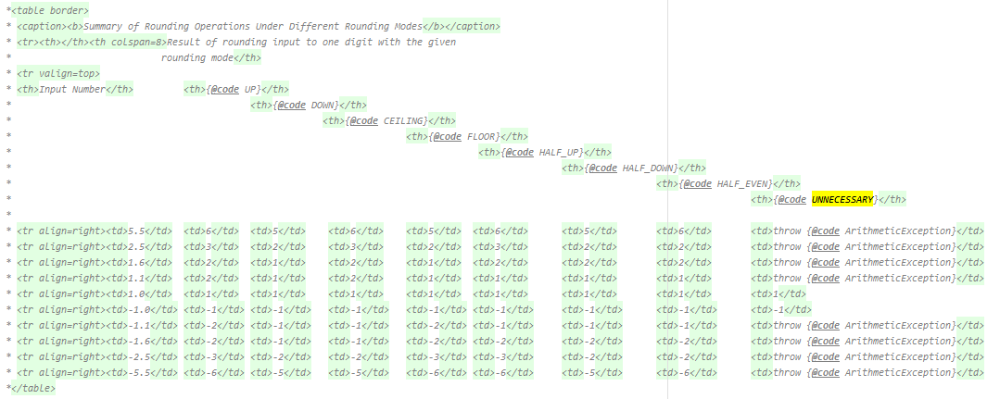
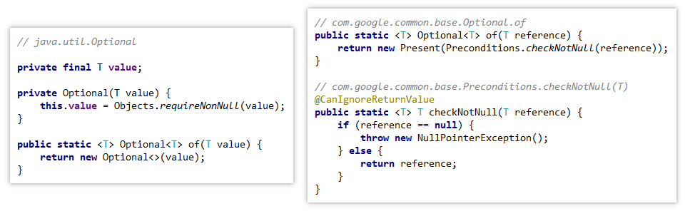

### 概述

> "Null sucks." -Doug Lea
> 
>"I call it my billion-dollar mistake." - Sir C. A. R. Hoare, on his invention of the null reference
 
粗心地使用 null 可能会导致各种 bug，通过研究 Google 代码库，guava 作者们发现有 95％ 的集合中不应该包含任何 null 值，实际上让程序快速失败而不是静默地接受 null 对开发人员是很有帮助的。

另外，null 会带来令人不愉快的模棱两可，因为 null 返回值应该意味着什么几乎是不明显的。例如，Map.get(key) 可以返回 null，因为映射表中的值为 null，或者该值不在映射中。null 可能意味着失败，也可能意味着成功，几乎可以意味着任何事情。使用其他东西而不是 null，可以使你的代码读起来更加清楚明朗。

就是说，有时候 null 是正确的选择。 就内存和速度而言，它是廉价的，并且在对象数组中 null 是不可避免的。但是在应用程序代码中，与库代码相反，它是造成混淆、疑难问题、怪异 bug 以及令人不快的歧义的主要原因，例如，当 Map.get 返回 null 时，可能意味着该值不存在，或者该值存在但为 null。最关键的是，null 不能解释它本身地含义。

由于这些原因，Guava 的许多工具类都被设计为在存在 null 的情况下快速失败，而不是允许使用 null。此外，Guava 提供了许多便利，既可以 null 在需要时简化使用，又可以帮助避免使用 null。此外，Guava 提供了许多便利，既可以在需要 null 时简化使用，又可以帮助避免使用 null。

### 具体案例

不要在 Set 中使用 null，也不要把 null 作为 Map 的键；在查询操作中，使用一个特殊值表示 null，这会让我们的语言更加清晰。

如果要把 null 用作 Map 中某个 key 的 value，请忽略该 entry，那怎么做呢？可以分别为空 key 和非空 key 维护不同的 Set。一个映射表中的 key 可能存在很多情况，比如说一个 key 存在对应的 entry，但是 entry 的 value 却是 null；也有可能是一个 key 在映射表中没有对应的 entry，这些情况很容易被混在一起。最好将这些 key 分开，并考虑一个关联着 null key 的 value 对你的应用程序意味着什么。

如果你在 List 中使用 null，并且列表是稀疏的，那么使用 Map<Integer, E> 可能会更高效，并且可能更符合你潜在的需求。

此外，我们可以考虑一下使用自然的 null 对象的情况。虽然这样的情况并不多，但还是有的，例如有一个枚举类型，其中有表示 null 的常量；还例如，在枚举 java.math.RoundingMode 里面有一个叫 UNNECESSARY 的常量（实际上它是个 int 类型的东西），它表示一种不做任何舍入操作的模式，如果用这种模式做舍入操作，则会抛出异常。

<div align="center"></img></div>

如果你确实需要使用 null 值，并且使用 Guava 的集合会有一些问题，那么你可以选择其他的实现。例如，使用 JDK 中的 Collections.unmodifiableList 代替 Guava 中的 ImmutableList。

### Optional

一般情况下，我们使用 null 表示某种缺失的情况：或许在某个值应该存在的地方，却没有值，或者根本就找不到对应的值。例如，在找不到键的值时 Map.get 返回 null。

Optional<T> 是一种用非空值替换可空引用 T 的方法。一个 Optional 或许包含非空 T 引用（即引用是 present 的），或许它不包含任何内容（即引用是 absent 的）。可以发现上面这些描述中没有出现 “包含 null‘ 的说法。

```java
Optional<Integer> possible = Optional.of(5);
possible.isPresent(); // returns true
possible.get(); // returns 5
```

Optional 不打算直接模拟其他编程环境中的 option 或 maybe 语义，尽管它们确实有些相似。下面列出了一些 Optional 最常见的操作。

#### 创建 Optional实例

这里给出的都是Optional的静态方法。

| 方法                                                         | 描述                                                         |
| ------------------------------------------------------------ | ------------------------------------------------------------ |
| [`Optional.of(T)`](http://google.github.io/guava/releases/snapshot/api/docs/com/google/common/base/Optional.html#of-T-) | 使 Optional 包含给定的非 null 值，或者在 null 上快速失败。   |
| [`Optional.absent()`](http://google.github.io/guava/releases/snapshot/api/docs/com/google/common/base/Optional.html#absent--) | 返回某种缺少的 Optional。                                    |
| [`Optional.fromNullable(T)`](http://google.github.io/guava/releases/snapshot/api/docs/com/google/common/base/Optional.html#fromNullable-T-) | 将给定的可能为 null 的引用转换为 Optional，将 non-null 视为存在，将 null 视为不存在。 |

by the way，guava 的 Optional 与 jdk1.8 提供的 Optional 相比，增加了快速失败的特性，即如果传入的引用为 null 时即抛出异常。

<div align="center"></img></div>

#### 查询方法

下面都是非静态的方法，因此需要特定的 Optional<T> 实例来调用。

| 方法                                                         | 描述                                                         |
| ------------------------------------------------------------ | ------------------------------------------------------------ |
| [`boolean isPresent()`](http://google.github.io/guava/releases/snapshot/api/docs/com/google/common/base/Optional.html#isPresent--) | 如果`Optional`包含非`null`的引用，则返回`true`               |
| [`T get()`](http://google.github.io/guava/releases/snapshot/api/docs/com/google/common/base/Optional.html#get--) | 返回`Optional`所包含的实例，若引用缺失，则抛出`java.lang.IllegalStateException` |
| [`T or(T)`](http://google.github.io/guava/releases/snapshot/api/docs/com/google/common/base/Optional.html#or-T-) | 返回`Optional`所包含的引用，若引用缺失，返回指定的值         |
| [`T orNull()`](http://google.github.io/guava/releases/snapshot/api/docs/com/google/common/base/Optional.html#orNull--) | 返回`Optional`所包含的引用，若引用缺失，返回 null，此为`fromNullable`的逆操作。 |
| [`Set asSet()`](http://google.github.io/guava/releases/snapshot/api/docs/com/google/common/base/Optional.html#asSet--) | 返回`Optional`所包含引用的单例不变集合，如果引用存在，返回一个只有单一元素的集合；如果引用缺失，返回一个空集合。 |

除了上面给出的方法之外，Optional 还提供了很多有用的工具方法，具体可以通过 Javadoc 来查看详细的资料。

#### 使用 Optional 的意义

除了增加使用 null 的可读性外，Optional 最大的优点就在于其防白痴功能，它会迫使你为了成功编译自己的代码而积极思考对象为 null 的情形，因为你必须主动点进 Optional 的源码看看到底问题出在哪里并解决这种情况。相比之下，null 使得编程人很容易忘记事情，尽管对 FindBugs 有所帮助，但我们认为它几乎不能解决问题。

特别地，当你返回一个值的时候，既可以是引用存在也可以是引用缺失。你（或者其他人）更容易忘记 `other.method(a, b)` 可以返回一个空值，就像你在实现一个方法 `other.method` 的时候，你也可能忘记参数a可以是一个 null 值一样。而将方法的返回类型指定为 Optional，可以迫使调用者思考返回为引用缺失的情形。

### 便利的方法

当你想使用某些默认值代替一个 null 值的时候，可以使用  [`MoreObjects.firstNonNull(T, T)`](http://google.github.io/guava/releases/snapshot/api/docs/com/google/common/base/MoreObjects.html#firstNonNull-T-T-) 方法。就像这个方法的名字提示的一样，如果输入的两个参数值都为 null，则会抛出 NullPointerException 异常。如果你使用 Optional 的话，这里有一些更好的替换方案，例如 first.or(second)。

在 Strings 类中，也提供了很多可以处理 String 值可能为空的方法。特别地，我们提供了恰当的名称：

- [`emptyToNull(String)`](http://google.github.io/guava/releases/snapshot/api/docs/com/google/common/base/Strings.html#emptyToNull-java.lang.String-)
- [`isNullOrEmpty(String)`](http://google.github.io/guava/releases/snapshot/api/docs/com/google/common/base/Strings.html#isNullOrEmpty-java.lang.String-)
- [`nullToEmpty(String)`](http://google.github.io/guava/releases/snapshot/api/docs/com/google/common/base/Strings.html#nullToEmpty-java.lang.String-)

我们要强调的是，这些方法主要用来与一些不友好的 API 进行交互，例如 `null` 字符串和空字符串等等。每当你写下混淆 `null` 和空字符串的时候，Guava 团队的成员都泪流满面。正确的做法是将空字符串和 `null` 字符串区别对待，但如果把两者等同，写出来的代码水准一般且让人不安。
